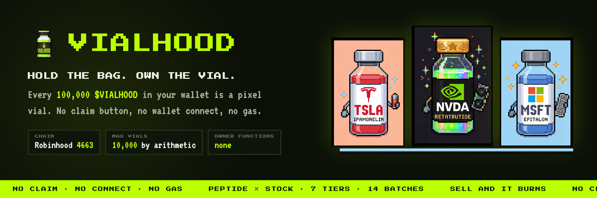
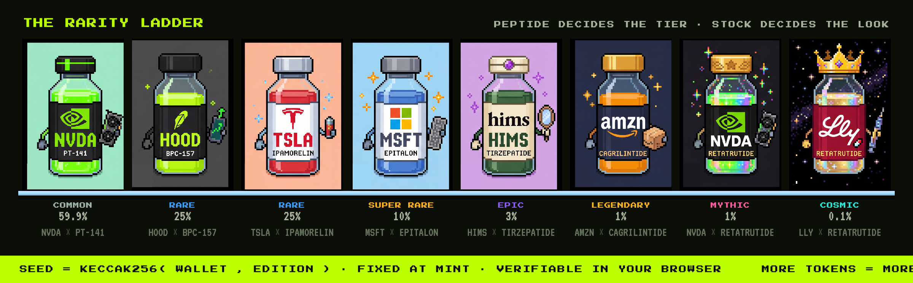
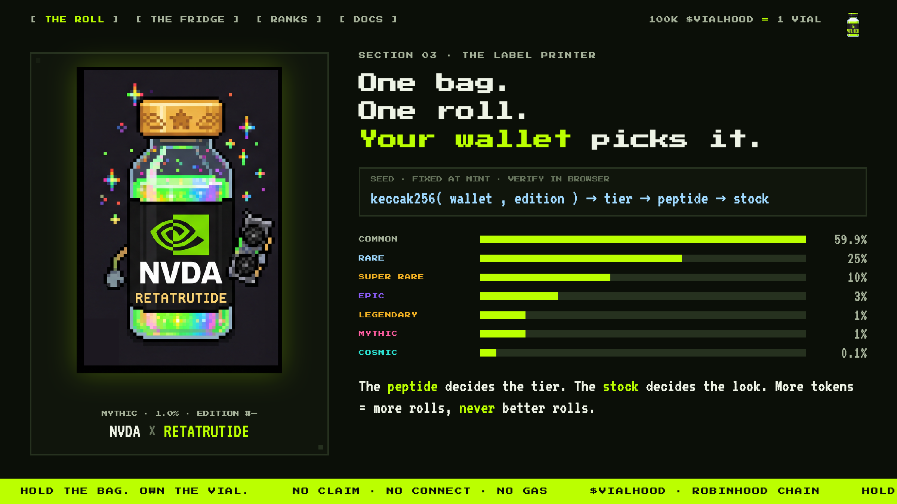
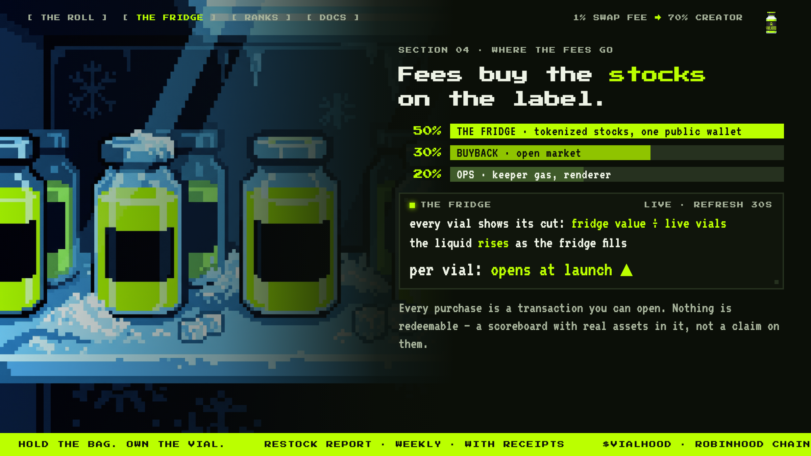

<!--
  GitHub profile README for https://github.com/vialhood
  Goes in a repo named exactly `vialhood` → vialhood/vialhood/README.md (root).
  Keep the `assets/` folder next to this file; the image paths below are relative.
-->

<div align="center">



<br><br>


**[vialhood.com](https://vialhood.com)** · **[app.vialhood.com](https://app.vialhood.com)** · **[@vialhood](https://x.com/vialhood)**

</div>

---

Ten thousand pixel vials on Robinhood Chain. Each one is a peptide label stamped by a stock, rolled
from the holder's own address. There is no claim button, no wallet connect, and no approval — the
contract reads your token balance and mints what the balance says you own.

Hold 100,000 `$VIALHOOD` and a vial appears. Sell below the line and the newest one burns.

## Live on Robinhood Chain

```
$VIALHOOD   0x182231403403DEBDb40C98c232D4f8C7226491FD
VialSync    0xF132C1640d559bfa7F902C3cfdc7C8D4E4174798
```

| | |
|---|---|
| `VialSync` contract | **deployed** at block 56,866,990 · 18 tests passing · mainnet source verification still open |
| Keeper | **running** — pays gas so holders never do |
| `$VIALHOOD` token | **live** |
| Site + app | live · [app.vialhood.com](https://app.vialhood.com) |

First day on-chain, read back with `lastEdition`, `ownerOf` and `seedOf`:
**1,309 editions minted · 752 live · 557 burned** by wallets that sold under the line · 2 cosmic, 9 mythic.
Those numbers move — [the feed](https://app.vialhood.com/feed) is the live version.

The rule we set for ourselves: **the vials work before the token exists.** They ran on testnet in
public first, and the first mainnet vial landed minutes after the token did.

> **No presale. No allocation. No whitelist.** Anyone messaging you about one is a scammer — there is
> nothing to allocate. The two addresses above are the only ones; they are posted on
> [@vialhood](https://x.com/vialhood) and on the site, and nowhere else.

---

## The roll



Every vial is drawn from one hash, fixed at mint and reproducible by anyone:

```solidity
seed = keccak256(abi.encodePacked(wallet, edition))
```

The seed picks a tier, then a peptide from that tier's pool, then one of fourteen stocks for the
label plate. **The peptide decides how rare the vial is; the stock decides how it looks.**

One bonus rule creates the grail: if the stock rolled is the real-world maker of the peptide rolled,
the tier moves up a step. `LLY × RETATRUTIDE` goes mythic → **cosmic**.



Editions come from a single global counter, so the edition you land on depends on everyone else's
activity — a seed cannot be ground out offline before buying. More tokens buy **more rolls, never
better rolls**, and rarity pays nothing at all. The moment rarity has a payout, people farm it with a
thousand wallets.

Supply is 1,000,000,000. Divided by 100,000, that is **10,000 vials maximum** — a cap by arithmetic,
not a promise, with no separate contract that could raise it.

---

## How a vial appears

```
buy $VIALHOOD  ──▶  keeper sees the Transfer  ──▶  VialSync.sync(wallet)
                                                          │
                                    entitled = balanceOf(wallet) / 100,000
                                    owned    = vials held
                                                          │
                          entitled > owned ──▶ mint the difference
                          entitled < owned ──▶ burn the difference, newest first
```

`sync(address)` is **public**. Anyone can call it, for any wallet, straight from the explorer. The
keeper runs it automatically because it is fast — not because it is required. When the keeper stalled
on launch day, a holder clicked *Sync my vials* on the wallet page and had their vial 2.9 seconds
later, because the decision was never the keeper's to make.

There is no mint authority key anywhere. Not on a server, not in a bot, not in a multisig.

## What the contract cannot do

The useful part of `VialSync` is the list of functions that were never written:

| | |
|---|---|
| `mint` by owner | ✗ absent |
| `pause` / `unpause` | ✗ absent |
| upgrade proxy | ✗ absent |
| change the threshold | ✗ absent |
| change metadata | ✗ absent |
| transfer / approve | ✗ disabled — phase 1 vials are soulbound |

Not timelocked. Not multisig-gated. **Absent.** A test asserts the compiled ABI contains none of
them, so the claim breaks the build if it ever stops being true.

The only key the system needs holds ETH for gas. If it leaks, the attacker gets to pay for other
people's vials to mint.

---

## The fridge



**Not open yet.** The wallet has not been published and no stock has been bought, so treat this
section as the rule we are committing to rather than something you can go and read on-chain today.

Every swap pays a 1% fee, of which 70% reaches the creator wallet in ETH and splits by a published rule:

| Share | Goes to |
|---|---|
| **50%** | the same tokenized stocks printed on the vial labels, into one public wallet |
| **30%** | buying `$VIALHOOD` back on the open market |
| **20%** | keeper gas, the renderer, the servers |

Every vial displays its cut — fridge value ÷ live vials — and the liquid level in the art rises with
it. Nothing is redeemable. It is a scoreboard with real assets in it, not a claim on them, and that
is written on the site rather than buried.

---

## Verify it yourself

The contract, its tests and the keeper are in **[vialhood-sync](https://github.com/vialhood/vialhood-sync)**.

```bash
git clone https://github.com/vialhood/vialhood-sync && cd vialhood-sync
pnpm i && pnpm test     # 18 tests on a simulated chain, ~3s
```

The tests are worked examples, not toy cases: buy 100k → one vial; buy 250k more → three; sell 60k →
the newest burns and its edition never returns; a whale buying 5% of supply mints 500 vials in
batches of 50; the pool and the routers never receive a vial; transfers revert.

Observed mainnet gas at 0.31 gwei: a 50-vial batch **~3.7M** (≈75–79k per vial), a burn **~20k**,
the deploy itself 2,878,588. Every vial ever minted cost the keeper, never the holder.

You do not have to trust this page either. `lastEdition()` gives the range and one Multicall3 call
reads `ownerOf` and `seedOf` for every edition — that is the entire collection, and it is what the
site itself does. The *verify the roll* button on each vial page recomputes its traits in your
browser from the stored seed.

---

## Cards

Every vial renders as a card — the tier sets the frame, foil from Epic up, the seed in the foot, and an
ON-CHAIN badge the page only prints after reading `ownerOf` and `seedOf`. Paste a wallet or an edition
number at **[app.vialhood.com/cards](https://app.vialhood.com/cards)** to generate, share or download
one as a PNG. Pairing an edition with the wrong wallet in a URL redirects to the real owner, so a card
can never show a vial that does not exist.

---

<sub><b>Disclaimer.</b> Vialhood is a collectible art project and a memecoin. The peptide names on vial labels are label codes in a pixel-art collection: nothing here is medical advice, no product is sold, and several named compounds are not approved for human use. Stock tickers and colourways are cultural references; Vialhood is not affiliated with, endorsed by, or connected to any company whose ticker appears on a vial, nor with Robinhood Markets. Tokenized stocks held in the fridge are price-tracking instruments, not shares; they are not redeemable by holders, and no payout, yield, or return is promised or implied. Vial rarity is a deterministic function of public data and confers no rights. <code>$VIALHOOD</code> is a token with no intrinsic value. Digital assets are volatile; never risk funds you cannot afford to lose.</sub>
